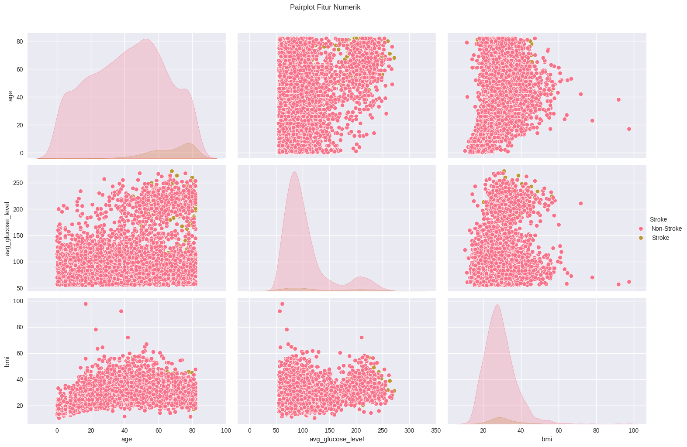

# Laporan Proyek Machine Learning – Mario Valerian Rante Ta'dung

---

## 1. Domain Proyek

Stroke merupakan salah satu penyebab utama kematian dan disabilitas di seluruh dunia. Berdasarkan laporan World Health Organization (WHO), setiap tahunnya terjadi sekitar 15 juta kasus stroke secara global, dengan 5 juta orang meninggal dunia dan 5 juta lainnya mengalami disabilitas permanen akibat penyakit ini [1]. Di Indonesia sendiri, beban akibat stroke tidak kalah mengkhawatirkan. Berdasarkan data Riskesdas 2018 yang dirilis oleh Kementerian Kesehatan Republik Indonesia, prevalensi stroke nasional mencapai 10,9 per 1.000 penduduk, menjadikannya sebagai penyakit katastropik dengan beban ekonomi dan sosial yang sangat besar [2].

Tak hanya berdampak pada kesehatan individu, stroke juga memberikan beban ekonomi yang signifikan terhadap sistem kesehatan nasional. Menurut studi yang dipublikasikan oleh American Heart Association, total beban ekonomi akibat stroke di tingkat global diperkirakan mencapai lebih dari US$ 721 miliar, termasuk di dalamnya biaya pengobatan, rehabilitasi, serta kerugian produktivitas akibat disabilitas dan kematian dini [3]. Di Indonesia, berdasarkan data BPJS Kesehatan tahun 2022, stroke termasuk dalam lima penyakit dengan biaya klaim tertinggi, mencapai lebih dari Rp2,5 triliun dalam satu tahun [4]. Kondisi ini menunjukkan pentingnya upaya preventif dan deteksi dini terhadap risiko stroke, terutama pada kelompok usia produktif.

Faktor risiko stroke pada dasarnya dapat dikenali dan dimitigasi lebih awal. Beberapa faktor seperti usia lanjut, hipertensi, diabetes, hiperkolesterolemia, riwayat merokok, dan aktivitas fisik rendah telah lama diketahui sebagai penyebab utama meningkatnya risiko stroke [5]. Namun, dalam praktiknya, banyak kasus baru teridentifikasi saat pasien sudah berada dalam kondisi kronis atau pasca-serangan. Situasi ini disebabkan oleh rendahnya kesadaran masyarakat akan gejala awal stroke serta terbatasnya fasilitas skrining dini, terutama di wilayah-wilayah dengan akses kesehatan terbatas.

Seiring dengan perkembangan teknologi di bidang machine learning (ML), kini tersedia pendekatan yang lebih efisien dan berskala dalam mendeteksi risiko stroke. Algoritma pembelajaran mesin memungkinkan analisis data medis secara otomatis untuk mengidentifikasi pola-pola yang tidak selalu terlihat secara kasat mata. Dengan memanfaatkan variabel seperti umur, jenis kelamin, tekanan darah, kadar glukosa, status merokok, dan kondisi kesehatan terkait lainnya, model prediksi berbasis ML dapat memberikan perkiraan risiko stroke dengan akurasi yang cukup tinggi. Teknologi ini memungkinkan intervensi medis lebih dini, serta pengambilan keputusan yang lebih berbasis data oleh penyedia layanan kesehatan.

Penerapan model prediksi semacam ini sangat relevan di Indonesia, mengingat keterbatasan dalam pemerataan layanan kesehatan dan kurangnya tenaga medis spesialis di banyak daerah. Sistem prediksi yang terintegrasi dalam aplikasi atau sistem informasi kesehatan dapat membantu menyaring individu berisiko tinggi untuk kemudian dirujuk ke pemeriksaan lebih lanjut. Dengan demikian, pendekatan ini tidak hanya meningkatkan efisiensi layanan, tetapi juga membantu menekan angka kejadian stroke dan beban biaya yang menyertainya.

Melalui proyek ini, penulis mencoba membangun sebuah model prediktif sederhana namun efektif untuk memprediksi kemungkinan seseorang mengalami stroke berdasarkan data demografis dan medis. Dengan memanfaatkan dataset terbuka yang tersedia secara publik, diharapkan proyek ini dapat menjadi salah satu langkah awal dalam menjembatani pemanfaatan teknologi kecerdasan buatan dalam bidang kesehatan preventif di Indonesia.

---

## 2. Business Understanding

### 2.1 Problem Statements

- **Pernyataan Masalah 1**  
  Beban penyakit stroke yang tinggi di Indonesia belum diiringi dengan sistem deteksi dini yang efektif, sehingga banyak kasus baru teridentifikasi saat sudah dalam kondisi kronis.

- **Pernyataan Masalah 2**  
  Kurangnya alat prediksi risiko stroke yang mudah diakses dan akurat menyebabkan rendahnya efektivitas screening dini, menghambat upaya pencegahan dan pengurangan angka kematian.

### 2.2 Goals

- **Jawaban Pernyataan Masalah 1**  
  Mengembangkan model prediksi risiko stroke berbasis machine learning dengan akurasi yang memadai untuk membantu deteksi dini risiko stroke.

- **Jawaban Pernyataan Masalah 2**  
  Membuat sistem prediksi yang sederhana, efektif, dan dapat diintegrasikan ke dalam aplikasi kesehatan untuk meningkatkan kemampuan screening awal risiko stroke.

### 2.3 Solution Statements

- **Solution Statement 1**  
  Menerapkan algoritma Random Forest dan Gradient Boosting sebagai baseline model klasifikasi risiko stroke karena performa baik pada data tabular medis dan kemampuannya dalam interpretasi fitur.

- **Solution Statement 2**  
  Melakukan hyperparameter tuning dan feature engineering untuk meningkatkan akurasi dan performa model, serta menggunakan teknik balancing data jika diperlukan untuk menangani ketidakseimbangan kelas.

- **Solution Statement 3**  
  Mengevaluasi model menggunakan metrik akurasi, precision, recall, dan F1-score agar model dapat meminimalkan false negative, yang krusial dalam konteks prediksi risiko stroke.

---

## 3. Data Understanding

Dataset yang digunakan adalah **Stroke Prediction Dataset** dari Kaggle ([https://www.kaggle.com/datasets/fedesoriano/stroke-prediction-dataset](https://www.kaggle.com/datasets/fedesoriano/stroke-prediction-dataset)). Terdiri atas 5.110 entri data dengan 2 kelas.

### 3.1 Deskripsi Dataset
| No. | Kolom               | Tipe Data | Jumlah Non-Null | Deskripsi                                                     |
| --- | ------------------- | --------- | --------------- | ------------------------------------------------------------- |
| 1   | `id`                | int64     | 5110            | ID unik untuk setiap data pasien                              |
| 2   | `gender`            | object    | 5110            | Jenis kelamin pasien                                          |
| 3   | `age`               | float64   | 5110            | Usia pasien                                                   |
| 4   | `hypertension`      | int64     | 5110            | 1 jika pasien memiliki hipertensi, 0 jika tidak               |
| 5   | `heart_disease`     | int64     | 5110            | 1 jika pasien memiliki penyakit jantung, 0 jika tidak         |
| 6   | `ever_married`      | object    | 5110            | Status pernikahan pasien                                      |
| 7   | `work_type`         | object    | 5110            | Jenis pekerjaan pasien                                        |
| 8   | `Residence_type`    | object    | 5110            | Jenis tempat tinggal: Urban (perkotaan) atau Rural (pedesaan) |
| 9   | `avg_glucose_level` | float64   | 5110            | Rata-rata kadar glukosa dalam darah                           |
| 10  | `bmi`               | float64   | 4909            | Indeks Massa Tubuh (BMI) pasien                               |
| 11  | `smoking_status`    | object    | 5110            | Status merokok pasien (tidak pernah, pernah, merokok, dll.)   |
| 12  | `stroke`            | int64     | 5110            | Target: 1 jika pasien pernah mengalami stroke, 0 jika belum   |

### 3.2 Korelasi Antar Fitur

- Berdasarkan heatmap korelasi, terlihat bahwa usia (age) memiliki korelasi positif tertinggi dengan stroke (0.25), diikuti oleh hipertensi (0.13) dan penyakit jantung (0.13), menunjukkan bahwa ketiga faktor ini berpotensi meningkatkan risiko stroke. Selain itu, ever_married (-0.11) dan work_type_children (0.54) memiliki korelasi signifikan dengan variabel lain, seperti usia, yang mengindikasikan bahwa status pernikahan dan pekerjaan mungkin memengaruhi profil risiko. Namun, Residence_type hampir tidak berkorelasi dengan variabel lain (nilai mendekati 0), sehingga kurang relevan sebagai prediktor. Korelasi negatif antara BMI (-0.45) dan work_type_children mencerminkan bahwa anak-anak cenderung memiliki BMI lebih rendah. Data juga menunjukkan multikolinearitas antara beberapa variabel, seperti usia dan work_type_children (0.63), yang perlu dipertimbangkan dalam pemodelan untuk menghindari bias. Secara keseluruhan, usia, kondisi medis (hipertensi, penyakit jantung), dan faktor gaya hidup (status merokok, BMI) adalah prediktor kunci yang memerlukan analisis lebih mendalam.

### 3.3 Distribusi Data

- Berdasarkan hasil eksplorasi data numerik, sebagian besar fitur memiliki distribusi yang tidak seimbang. Fitur age terdistribusi relatif normal dengan mayoritas di usia 40–60 tahun, namun terdapat nilai ekstrem seperti 0.08 yang perlu diverifikasi. Fitur avg_glucose_level dan bmi menunjukkan distribusi miring ke kanan (right-skewed) dengan beberapa outlier ekstrem, sehingga transformasi log atau scaling dapat dipertimbangkan. Rata-rata BMI (28.89) menunjukkan populasi cenderung overweight, dan terdapat 201 nilai kosong pada fitur ini yang perlu ditangani. Fitur biner seperti hypertension dan heart_disease didominasi oleh nilai nol (tidak memiliki kondisi tersebut), sementara label target stroke juga sangat tidak seimbang (hanya sekitar 4.9% kasus positif), sehingga perlu penanganan class imbalance saat membangun model prediksi.

### 3.4 Outliers

- Fitur age tidak memiliki outlier, namun tetap mengandung nilai sangat rendah mendekati nol yang perlu divalidasi kebenarannya. Fitur avg_glucose_level mengandung outlier cukup banyak yaitu 627 data (12.3%), dengan nilai yang jauh lebih tinggi dari rentang interkuartil, menunjukkan distribusi yang sangat skewed. Fitur bmi juga memiliki 110 outlier (2.2%), meskipun skalanya tidak se-ekstrem avg_glucose_level. Keberadaan outlier pada kedua fitur ini dapat mempengaruhi kinerja model prediktif, sehingga perlu dipertimbangkan apakah akan ditangani melalui metode winsorizing, transformasi log, atau penghapusan langsung. Sementara itu, plot terakhir kosong karena tidak ada fitur numerik keempat yang ditampilkan. Secara keseluruhan, penanganan outlier menjadi salah satu langkah penting dalam preprocessing data ini.

### 3.5 Distribusi Data pada Kelas Target

- Sebagian besar data (sekitar 95.1%) berasal dari individu yang tidak mengalami stroke, sementara hanya 4.9% data berasal dari individu yang mengalami stroke. Ketidakseimbangan ini menunjukkan bahwa dataset bersifat imbalanced, yang dapat menyebabkan model machine learning cenderung bias terhadap kelas mayoritas. Oleh karena itu, perlu dipertimbangkan penanganan khusus seperti resampling (oversampling kelas minoritas atau undersampling kelas mayoritas), penggunaan algoritma yang robust terhadap ketidakseimbangan kelas, atau penerapan class weight adjustment untuk menghasilkan model yang lebih adil dan akurat dalam mendeteksi kasus stroke.

### 3.6 Variabel Kategorikal terhadap Variabel Target

- Terlihat bahwa proporsi penderita stroke sedikit lebih tinggi pada individu yang pernah menikah dibandingkan yang belum menikah. Pada variabel jenis kelamin, baik pria maupun wanita memiliki proporsi stroke yang hampir serupa, sementara kategori "Other" terlalu sedikit untuk dianalisis secara representatif. Terkait jenis pekerjaan, kelompok self-employed dan private menunjukkan persentase stroke yang lebih tinggi dibanding kelompok lain. Pada fitur smoking status, individu yang merokok atau pernah merokok memiliki persentase stroke yang lebih tinggi dibandingkan yang tidak merokok atau status merokoknya tidak diketahui. Temuan ini menunjukkan adanya perbedaan risiko stroke berdasarkan faktor gaya hidup dan status sosial-demografis tertentu, yang penting untuk diperhatikan dalam analisis prediktif lebih lanjut.

### 3.7 Pairplot Fitur Numerik

- Usia (age): Hampir semua kasus stroke terjadi pada individu berusia di atas 50 tahun, dengan konsentrasi tertinggi antara 60–80 tahun. Hal ini menunjukkan bahwa risiko stroke meningkat signifikan seiring bertambahnya usia.
- Tingkat Glukosa Rata-rata (avg_glucose_level): Penderita stroke cenderung memiliki kadar glukosa darah yang lebih tinggi, sebagian besar di atas 150. Ini mendukung hipotesis bahwa kadar gula darah tinggi (misalnya akibat diabetes) merupakan faktor risiko stroke.
- BMI (bmi): Tidak terlihat pola yang sangat jelas antara BMI dan stroke, namun sebagian besar penderita stroke berada dalam rentang BMI 25–40, yang termasuk kategori overweight hingga obesitas. Hal ini menunjukkan bahwa kelebihan berat badan bisa menjadi salah satu faktor pendukung, meskipun tidak sekuat usia dan kadar glukosa.

---

## 4. Data Preparation
### 4.1 Drop Kolom yang Tidak Relevan (ID, Duplikat)

### 4.2 Menangani Missing Values

### 4.3 Encoding Variabel Kategorikal

### 4.4 Menangani Outlier

### 4.5 Feature Engineering
| Fitur Baru                | Deskripsi                                              |
| ------------------------- | ------------------------------------------------------ |
| `age_group`               | Kategori usia (muda, dewasa, lansia)                   |
| `glucose_bmi_interaction` | Interaksi kadar glukosa dan BMI                        |
| `glucose_per_bmi`         | Rasio kadar glukosa terhadap BMI                       |
| `age_x_smoking`           | Efek gabungan usia dan status merokok                  |
| `chronic_risk`            | 1 jika pasien memiliki hipertensi dan penyakit jantung |
| `is_employed`             | 1 jika pasien bekerja, 0 jika anak atau tidak bekerja  |
| `gender_hyper`            | Efek gabungan jenis kelamin dan hipertensi             |

### 4.6 Split Data untuk Pelatihan

---

## 5. Modeling

## 6. Evaluasi

### 6.1 Classification Report
| Label            | Precision | Recall | F1-Score | Support |
| ---------------- | --------- | ------ | -------- | ------- |
| Non-Stroke       | 0.96      | 0.98   | 0.97     | 972     |
| Stroke           | 0.33      | 0.20   | 0.25     | 50      |
| **Accuracy**     |           |        | **0.94** | 1022    |
| **Macro Avg**    | 0.65      | 0.59   | 0.61     | 1022    |
| **Weighted Avg** | 0.93      | 0.94   | 0.93     | 1022    |

### 6.2 Confusion Matrix

### 6.3 ROV Curve

## Referensi

[1] World Health Organization. (2018). The top 10 causes of death.  
[2] Kementerian Kesehatan Republik Indonesia. (2018). Riset Kesehatan Dasar (Riskesdas) 2018.  
[3] American Heart Association. (2021). Economic Burden of Stroke in the United States.  
[4] BPJS Kesehatan. (2022). Laporan Pengelolaan Program JKN Tahun 2022.  
[5] Harvard Health Publishing. (2022). Stroke: Risk factors you can control.  
