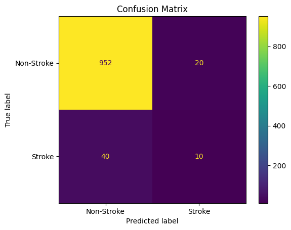
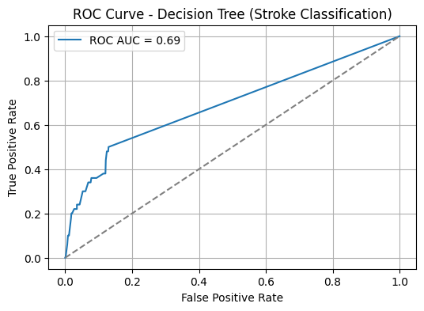

# Laporan Proyek Machine Learning – Mario Valerian Rante Ta'dung


## 1. Domain Proyek

Stroke merupakan salah satu penyebab utama kematian dan disabilitas di seluruh dunia. Pada tahun 2021, stroke menjadi penyebab kematian terbesar ketiga di dunia, menyumbang sekitar 10% dari total kematian global. Posisinya turun satu tingkat dari 2019 karena kemunculan COVID-19 yang menggeser peringkat penyakit lain [1]. Di Indonesia sendiri, beban akibat stroke sangat mengkhawatirkan. Berdasarkan Riskesdas 2023, prevalensi stroke di Indonesia turun menjadi 8,3 persen dari 10,9 persen pada 2018 [2]. Namun, meski angka prevalensi menurun, jumlah pasien stroke justru terus bertambah setiap tahun karena pertumbuhan populasi.

Stroke menimbulkan beban ekonomi global yang sangat besar, dengan total biaya diperkirakan lebih dari US$ 721 miliar atau sekitar 0,66% dari PDB dunia [3]. Biaya ini mencakup pengobatan, rehabilitasi, serta kerugian produktivitas akibat disabilitas dan kematian dini. Menurut Direktur Pencegahan dan Pengendalian Penyakit Tidak Menular (P2PTM) Kemenkes, Siti Nadia Tarmizi, meningkatnya jumlah pasien stroke menjadikan beban biaya penyakit ini menempati posisi ketiga setelah jantung dan kanker [2]. Pada tahun 2023, biaya yang dibutuhkan untuk penanganan stroke mencapai Rp 5,2 triliun, sementara biaya untuk penyakit jantung sebesar Rp 17,6 triliun dan kanker sebesar Rp 5,9 triliun.

Faktor risiko stroke pada dasarnya dapat dikenali dan dimitigasi lebih awal. Studi menunjukkan bahwa kasus stroke berkaitan dengan sepuluh faktor risiko yang dapat dimodifikasi, seperti hipertensi, diabetes, hiperkolesterolemia, riwayat merokok, obesitas, kurang aktivitas fisik, konsumsi alkohol berlebih, stres, penyakit jantung, dan pola makan tidak sehat [4]. Namun, dalam prakteknya, banyak kasus baru teridentifikasi saat pasien sudah berada dalam kondisi kronis atau pasca-serangan. Situasi ini disebabkan oleh rendahnya kesadaran masyarakat akan gejala awal stroke serta terbatasnya fasilitas skrining dini, terutama di wilayah-wilayah dengan akses kesehatan terbatas.

Seiring dengan perkembangan teknologi di bidang machine learning (ML), kini tersedia pendekatan yang lebih efisien dan berskala dalam mendeteksi risiko stroke. Algoritma pembelajaran mesin memungkinkan analisis data medis secara otomatis untuk mengidentifikasi pola-pola yang tidak selalu terlihat secara kasat mata. Dengan memanfaatkan variabel seperti umur, jenis kelamin, tekanan darah, kadar glukosa, status merokok, dan kondisi kesehatan terkait lainnya, model prediksi berbasis ML dapat memberikan perkiraan risiko stroke dengan akurasi yang tinggi. Teknologi ini memungkinkan intervensi medis lebih dini serta pengambilan keputusan yang lebih berbasis data oleh penyedia layanan kesehatan.

Penerapan model prediksi semacam ini sangat relevan di Indonesia, mengingat keterbatasan dalam pemerataan layanan kesehatan dan kurangnya tenaga medis spesialis di banyak daerah. Sistem prediksi yang terintegrasi dalam aplikasi atau sistem informasi kesehatan dapat membantu menyaring individu berisiko tinggi untuk kemudian dirujuk ke pemeriksaan lebih lanjut. Dengan demikian, pendekatan ini tidak hanya meningkatkan efisiensi layanan, tetapi juga membantu menekan angka kejadian stroke dan beban biaya yang menyertainya.

Melalui proyek ini, penulis mencoba membangun sebuah model prediktif sederhana namun efektif untuk memprediksi kemungkinan seseorang mengalami stroke berdasarkan data. Dengan memanfaatkan dataset terbuka yang tersedia secara publik, diharapkan proyek ini dapat menjadi salah satu langkah awal dalam menjembatani pemanfaatan teknologi kecerdasan buatan dalam bidang kesehatan preventif di Indonesia.

---

## 2. Business Understanding

### 2.1 Problem Statements

* **Problem Statements 1**
  
  Penyakit stroke merupakan salah satu penyebab kematian tertinggi di Indonesia, namun teknologi sistem deteksi dini yang andal dan efektif masih minim. Hal ini menyebabkan banyak kasus baru teridentifikasi ketika kondisi pasien sudah kronis dan sulit ditangani secara preventif.

* **Problem Statements 2**
  
  Karakteristik data kesehatan yang tidak seimbang, di mana jumlah pasien non-stroke jauh lebih besar dibandingkan pasien stroke, membuat sebagian besar model machine learning cenderung bias terhadap kelas mayoritas. Hal ini mengakibatkan tingginya kesalahan dalam mendeteksi pasien yang sebenarnya memiliki risiko stroke.

---

### 2.2 Goals

* **Goals 1**
  
  Mengembangkan model prediksi risiko stroke berbasis machine learning yang dapat digunakan untuk membantu deteksi dini, dengan mempertimbangkan performa pada kedua kelas secara adil.

* **Goals 2**
  
  Menghasilkan model yang mampu mempertahankan performa prediksi pada kelas minoritas (stroke) agar dapat diimplementasikan dalam sistem skrining kesehatan yang akurat dan dapat diandalkan.

---

### 2.3 Solution Statements

* **Solution Statement 1**
  
  Mengimplementasikan beberapa algoritma klasifikasi berbasis pohon keputusan seperti **Random Forest**, **Gradient Boosting (XGBoost, LightGBM, CatBoost)**, dan **Decision Tree**, yang dikenal efektif untuk data tabular dan memiliki fleksibilitas dalam menangani fitur non-linear serta mendukung interpretabilitas. 

* **Solution Statement 2**
  
  Melakukan **hyperparameter tuning** menggunakan framework Optuna untuk meningkatkan kinerja model, dengan fokus pada metrik evaluasi **F1 Score (macro average)**, guna menangani ketidakseimbangan kelas serta meningkatkan deteksi pada kasus stroke.

* **Solution Statement 3**
  
  Menerapkan teknik evaluasi berbasis **confusion matrix** dan **classification report** dan **Kurva ROC**, serta memilih model terbaik berdasarkan **F1-score macro** sebagai tolok ukur utama, karena metrik ini menghitung performa model secara setara untuk semua kelas dan relevan dalam konteks medis yang menuntut keakuratan tinggi pada kelas minoritas.

---

## 3. Data Understanding

Dataset yang digunakan adalah **Stroke Prediction Dataset** dari Kaggle ([https://www.kaggle.com/datasets/fedesoriano/stroke-prediction-dataset](https://www.kaggle.com/datasets/fedesoriano/stroke-prediction-dataset)). Terdiri atas 5.110 entri data dengan 2 kelas. Data ini cukup mendekati karakteristik variabel yang menandai stroke berdasarkan riset yang telah disampaikan pada latar belakang.

### 3.1 Deskripsi Dataset
| No. | Kolom               | Tipe Data | Jumlah Non-Null | Deskripsi                                                     |
| --- | ------------------- | --------- | --------------- | ------------------------------------------------------------- |
| 1   | `id`                | int64     | 5110            | ID unik untuk setiap data pasien                              |
| 2   | `gender`            | object    | 5110            | Jenis kelamin pasien                                          |
| 3   | `age`               | float64   | 5110            | Usia pasien                                                   |
| 4   | `hypertension`      | int64     | 5110            | 1 jika pasien memiliki hipertensi, 0 jika tidak               |
| 5   | `heart_disease`     | int64     | 5110            | 1 jika pasien memiliki penyakit jantung, 0 jika tidak         |
| 6   | `ever_married`      | object    | 5110            | Status pernikahan pasien                                      |
| 7   | `work_type`         | object    | 5110            | Jenis pekerjaan pasien                                        |
| 8   | `Residence_type`    | object    | 5110            | Jenis tempat tinggal: Urban (perkotaan) atau Rural (pedesaan) |
| 9   | `avg_glucose_level` | float64   | 5110            | Rata-rata kadar glukosa dalam darah                           |
| 10  | `bmi`               | float64   | 4909            | Indeks Massa Tubuh (BMI) pasien                               |
| 11  | `smoking_status`    | object    | 5110            | Status merokok pasien (tidak pernah, pernah, merokok, dll.)   |
| 12  | `stroke`            | int64     | 5110            | Target: 1 jika pasien pernah mengalami stroke, 0 jika belum   |

### 3.2 Korelasi Antar Fitur

- Heatmap korelasi tersebut menunjukkan bahwa tidak ada fitur numerik yang memiliki korelasi tinggi terhadap risiko stroke, namun beberapa fitur menunjukkan hubungan positif meskipun lemah. Variabel age memiliki korelasi tertinggi dengan stroke (0.25), diikuti oleh hypertension, heart_disease, dan avg_glucose_level yang masing-masing memiliki korelasi sekitar 0.13. Sementara itu, bmi menunjukkan korelasi yang sangat rendah (0.04), menandakan hubungan linier yang nyaris tidak ada. Korelasi antar fitur juga tergolong rendah, dengan yang tertinggi adalah antara age dan bmi (0.33), sehingga tidak ditemukan masalah multikolinearitas.

### 3.3 Distribusi Data

- Berdasarkan hasil eksplorasi data numerik, sebagian besar fitur memiliki distribusi yang tidak seimbang. Fitur age terdistribusi relatif normal dengan mayoritas di usia 40–60 tahun, namun terdapat nilai ekstrem seperti 0.08 yang perlu diverifikasi. Fitur avg_glucose_level dan bmi menunjukkan distribusi miring ke kanan (right-skewed) dengan beberapa outlier ekstrem, sehingga transformasi log atau scaling dapat dipertimbangkan. Rata-rata BMI (28.89) menunjukkan populasi cenderung overweight, dan terdapat 201 nilai kosong pada fitur ini yang perlu ditangani. Fitur biner seperti hypertension dan heart_disease didominasi oleh nilai nol (tidak memiliki kondisi tersebut), sementara label target stroke juga sangat tidak seimbang (hanya sekitar 4.9% kasus positif), sehingga perlu penanganan class imbalance saat membangun model prediksi.

### 3.4 Outliers

- Fitur age tidak memiliki outlier, namun tetap mengandung nilai sangat rendah mendekati nol yang perlu divalidasi kebenarannya. Fitur avg_glucose_level mengandung outlier cukup banyak yaitu 627 data (12.3%), dengan nilai yang jauh lebih tinggi dari rentang interkuartil, menunjukkan distribusi yang sangat skewed. Fitur bmi juga memiliki 110 outlier (2.2%), meskipun skalanya tidak se-ekstrem avg_glucose_level. Keberadaan outlier pada kedua fitur ini dapat mempengaruhi kinerja model prediktif, sehingga perlu dipertimbangkan apakah akan ditangani melalui metode winsorizing, transformasi log, atau penghapusan langsung. Sementara itu, plot terakhir kosong karena tidak ada fitur numerik keempat yang ditampilkan. Secara keseluruhan, penanganan outlier menjadi salah satu langkah penting dalam preprocessing data ini.

### 3.5 Distribusi Data pada Kelas Target

- Sebagian besar data (sekitar 95.1%) berasal dari individu yang tidak mengalami stroke, sementara hanya 4.9% data berasal dari individu yang mengalami stroke. Ketidakseimbangan ini menunjukkan bahwa dataset bersifat imbalanced, yang dapat menyebabkan model machine learning cenderung bias terhadap kelas mayoritas. Oleh karena itu, perlu dipertimbangkan penanganan khusus seperti resampling (oversampling kelas minoritas atau undersampling kelas mayoritas), penggunaan algoritma yang robust terhadap ketidakseimbangan kelas, atau penerapan class weight adjustment untuk menghasilkan model yang lebih adil dan akurat dalam mendeteksi kasus stroke.

### 3.6 Variabel Kategorikal terhadap Variabel Target

- Terlihat bahwa proporsi penderita stroke sedikit lebih tinggi pada individu yang pernah menikah dibandingkan yang belum menikah. Pada variabel jenis kelamin, baik pria maupun wanita memiliki proporsi stroke yang hampir serupa, sementara kategori "Other" terlalu sedikit untuk dianalisis secara representatif. Terkait jenis pekerjaan, kelompok self-employed dan private menunjukkan persentase stroke yang lebih tinggi dibanding kelompok lain. Pada fitur smoking status, individu yang merokok atau pernah merokok memiliki persentase stroke yang lebih tinggi dibandingkan yang tidak merokok atau status merokoknya tidak diketahui. Temuan ini menunjukkan adanya perbedaan risiko stroke berdasarkan faktor gaya hidup dan status sosial-demografis tertentu, yang penting untuk diperhatikan dalam analisis prediktif lebih lanjut.

### 3.7 Pairplot Fitur Numerik

- Usia (age): Hampir semua kasus stroke terjadi pada individu berusia di atas 50 tahun, dengan konsentrasi tertinggi antara 60–80 tahun. Hal ini menunjukkan bahwa risiko stroke meningkat signifikan seiring bertambahnya usia.
- Tingkat Glukosa Rata-rata (avg_glucose_level): Penderita stroke cenderung memiliki kadar glukosa darah yang lebih tinggi, sebagian besar di atas 150. Ini mendukung hipotesis bahwa kadar gula darah tinggi (misalnya akibat diabetes) merupakan faktor risiko stroke.
- BMI (bmi): Tidak terlihat pola yang sangat jelas antara BMI dan stroke, namun sebagian besar penderita stroke berada dalam rentang BMI 25–40, yang termasuk kategori overweight hingga obesitas. Hal ini menunjukkan bahwa kelebihan berat badan bisa menjadi salah satu faktor pendukung, meskipun tidak sekuat usia dan kadar glukosa.

---

## 4. Data Preparation
### 4.1 Drop Kolom yang Tidak Relevan (ID, Duplikat)
Terdapat dua bagian utama dalam data preparation tahap 1:

* **Menghapus kolom tidak relevan:**
  Kolom `id` merupakan identifier unik yang tidak memberikan informasi prediktif terhadap risiko stroke, sehingga dihapus dari dataset.

* **Menghapus duplikasi data:**
  Data duplikat dapat menyebabkan model bias terhadap nilai yang berulang dan mengganggu distribusi data. Oleh karena itu, dilakukan penghapusan data duplikat untuk meningkatkan kualitas dataset.


```python
df_prep = df_prep.drop(columns=['id'])  
df_prep = df_prep.drop_duplicates()
```

### 4.2 Encoding Variabel Kategorikal

Pada tahap praproses data, dilakukan konversi nilai kategorikal menjadi numerik agar dapat digunakan oleh algoritma machine learning. Beberapa kolom seperti `gender`, `ever_married`, `Residence_type`, dan `smoking_status` dikonversi secara manual menggunakan pemetaan nilai (label encoding) sesuai dengan makna ordinal atau kategorinya. Sementara untuk kolom `work_type`, digunakan teknik one-hot encoding agar model dapat menangani data kategorikal nominal tanpa mengasumsikan urutan, dan argumen `drop_first=True` diterapkan untuk menghindari multikolinearitas. Pendekatan ini memastikan data input berada dalam format numerik yang dapat diterima model sekaligus mempertahankan informasi kategori secara optimal.

```python
df_prep['gender'] = df_prep['gender'].apply(lambda x: 0 if x == 'Male' else 1 if x == "Female" else 2)
df_prep['ever_married'] = df_prep['ever_married'].apply(lambda x: 0 if x == 'Yes' else 1)
df_prep['Residence_type'] = df_prep['Residence_type'].apply(lambda x: 0 if x == 'Urban' else 1)

smoke_mapping = {
    'never smoked': 0,
    'formerly smoked': 1,
    'smokes': 2,
    'Unknown': 3
}
df_prep['smoking_status'] = df_prep['smoking_status'].map(smoke_mapping)
df_prep = pd.get_dummies(df_prep, columns=['work_type'], drop_first=True, prefix='work_type', dtype=int)
```

### 4.3 Menangani Missing Values

Pada tahap imputasi missing value, digunakan metode **KNNImputer** dengan 5 neighbors terdekat untuk mengisi nilai kosong, khususnya pada kolom `bmi`. Metode ini dipilih karena mampu mempertimbangkan kemiripan antar data dalam mengisi nilai yang hilang, sehingga lebih akurat dibandingkan imputasi sederhana seperti mean atau median global. Dengan pendekatan ini, nilai yang hilang diisi berdasarkan rata-rata nilai dari data terdekat yang serupa, sehingga menjaga konsistensi pola dalam dataset.

```python
imputer = KNNImputer(n_neighbors=5)  
bmi_imputed = imputer.fit_transform(df_prep)
df_imputed = pd.DataFrame(bmi_imputed, columns=df_prep.columns)
```

### 4.4 Menangani Outlier

Dalam tahap pembersihan data, dilakukan proses winsorizing pada dua fitur kontinu, yaitu `avg_glucose_level` dan `bmi`, untuk mengurangi pengaruh outlier ekstrem yang dapat mengganggu performa model machine learning. Metode winsorize menggantikan nilai-nilai ekstrem di bawah persentil 5 dan di atas persentil 95 dengan nilai-nilai batas tersebut. Teknik ini dipilih karena mempertahankan distribusi data tanpa menghapus observasi apa pun, sehingga tetap menjaga ukuran sampel dan mengurangi distorsi akibat nilai pencilan.

```python
con_columns = ['avg_glucose_level', 'bmi']
df_imputed[con_columns] = df_imputed[con_columns].apply(lambda x: winsorize(x, (0.05, 0.05)))
```

### 4.5 Feature Engineering

Membuat beberapa fitur baru dengan mengelompokkan usia ke dalam kategori, serta menggabungkan atau mengalikan beberapa variabel seperti kadar glukosa, BMI, usia, status merokok, hipertensi, penyakit jantung, jenis kelamin, dan status pekerjaan. Tujuannya adalah untuk menangkap interaksi dan kondisi risiko kesehatan yang mungkin penting untuk analisis atau pemodelan, sehingga data menjadi lebih informatif dan membantu model mengenali pola yang lebih kompleks.

| Fitur Baru                | Deskripsi                                              |
| ------------------------- | ------------------------------------------------------ |
| `age_group`               | Kategori usia (muda, dewasa, lansia)                   |
| `glucose_bmi_interaction` | Interaksi kadar glukosa dan BMI                        |
| `glucose_per_bmi`         | Rasio kadar glukosa terhadap BMI                       |
| `age_x_smoking`           | Efek gabungan usia dan status merokok                  |
| `chronic_risk`            | 1 jika pasien memiliki hipertensi dan penyakit jantung |
| `is_employed`             | 1 jika pasien bekerja, 0 jika anak atau tidak bekerja  |
| `gender_hyper`            | Efek gabungan jenis kelamin dan hipertensi             |


### 4.6 Split Data untuk Pelatihan

Dataset yang telah dibersihkan kemudian dipisahkan menjadi fitur (`X`) dan label target (`y`), di mana label target adalah kolom `stroke`. Selanjutnya, data dibagi menjadi data latih dan data uji menggunakan fungsi `train_test_split` dengan proporsi 80% untuk pelatihan dan 20% untuk pengujian. Parameter `stratify=y` digunakan untuk memastikan distribusi kelas pada data latih dan data uji tetap seimbang, terutama karena label `stroke` memiliki distribusi yang tidak seimbang. Penggunaan `random_state=42` memastikan reprodusibilitas hasil.

```python
X = df_imputed.drop(columns=['stroke'])
y = df_imputed['stroke']

X_train, X_test, y_train, y_test = train_test_split(X, y, test_size=0.2, random_state=42, stratify=y)
```
---

## 5. Modeling

### 5.1 Model Selection

Pada tahap ini, dilakukan evaluasi terhadap lima model machine learning untuk klasifikasi risiko stroke. Setiap model dievaluasi menggunakan **5-fold Stratified Cross Validation** dengan metrik **F1-score macro**, karena data bersifat tidak seimbang. Berikut penjelasan **cara kerja**, **parameter yang digunakan**, serta **kelebihan dan kekurangan** masing-masing model:

#### A. **Random Forest**

**Cara kerja:**
Random Forest adalah ensemble learning method berbasis Decision Tree. Model ini membangun banyak pohon keputusan (trees) dari subset data (bootstrap samples) dan subset fitur secara acak, kemudian menggabungkan prediksi pohon-pohon tersebut menggunakan voting (klasifikasi) atau rata-rata (regresi).

**Parameter yang digunakan:**

```python
RandomForestClassifier(random_state=42)
```

* `random_state=42`: Menjamin reprodusibilitas.
* Untuk parameter lainnya menggunakan nilai default, seperti:

  * `n_estimators=100`: Jumlah pohon dalam forest.
  * `criterion='gini'`: Ukuran pemisahan berdasarkan impurity Gini.
  * `max_depth=None`: Kedalaman maksimum pohon; `None` berarti tanpa batas.
  * `min_samples_split=2`: Minimal sampel untuk membagi node internal.
  * `min_samples_leaf=1`: Minimal sampel yang harus ada di tiap daun.

**Kelebihan:**

* Robus terhadap overfitting.
* Dapat menangani data tidak seimbang melalui agregasi.
* Mendukung `class_weight='balanced'` jika diperlukan.

**Kekurangan:**

* Bisa tetap bias terhadap kelas mayoritas tanpa penyesuaian eksplisit.
* Interpretasi model sulit.
* F1-score untuk kelas minoritas bisa rendah.


#### B. **Decision Tree**

**Cara kerja:**
Decision Tree membuat model pohon dengan memisahkan data berdasarkan fitur yang memberikan *information gain* atau pengurangan impurity terbesar. Setiap simpul pohon merupakan keputusan berbasis nilai fitur tertentu.

**Parameter yang digunakan:**

```python
DecisionTreeClassifier(random_state=42)
```

* `random_state=42`: Untuk reprodusibilitas hasil.
* Untuk parameter lainnya menggunakan nilai default, seperti:

  * `criterion='gini'`: Ukuran pemisahan berdasarkan impurity Gini.
  * `max_depth=None`: Kedalaman maksimum pohon; `None` berarti tanpa batas.
  * `min_samples_split=2`: Minimal sampel untuk membagi node internal.
  * `min_samples_leaf=1`: Minimal sampel yang harus ada di tiap daun.
  * `max_features=None`: Semua fitur digunakan saat mencari pemisahan terbaik.

**Kelebihan:**

* Mudah diinterpretasikan dan divisualisasikan.
* Cepat dalam pelatihan dan prediksi.
* Mendukung pengaturan `class_weight` untuk kelas minoritas.

**Kekurangan:**

* Rentan overfitting.
* Cenderung bias ke kelas mayoritas jika tidak disesuaikan.
* Performa tergantung hyperparameter dan pruning.


#### C. **XGBoost**

**Cara kerja:**
XGBoost (Extreme Gradient Boosting) adalah algoritma boosting yang membangun model secara bertahap, memperbaiki kesalahan dari model sebelumnya menggunakan **gradient descent pada fungsi loss**. Model ini juga dilengkapi regularisasi untuk mencegah overfitting.

**Parameter yang digunakan:**

```python
XGBClassifier(use_label_encoder=False, eval_metric='logloss', random_state=42)
```

* `use_label_encoder=False`: Mencegah warning pada versi baru XGBoost.
* `eval_metric='logloss'`: Metrik evaluasi selama training.
* `random_state=42`: Untuk reprodusibilitas.
* Untuk parameter lainnya menggunakan nilai default, seperti:

  * `n_estimators=100`: Jumlah pohon yang dibangun secara berurutan.
  * `eta=0.3`: `learning_rate`; Mengontrol kontribusi setiap pohon terhadap model akhir.
  * `max_depth=6`: Kedalaman maksimum setiap pohon; mengontrol kompleksitas model.
  * `min_child_weight=1`: Jumlah minimal bobot total (sum of instance weight) di anak node; mencegah overfitting.
  * `gamma=0`: `min_split_loss`; Minimal loss reduction yang diperlukan untuk membagi node; `0` berarti tidak ada batasan tambahan.

**Kelebihan:**

* Sangat kuat untuk data kompleks dan tidak seimbang.
* Mendukung `scale_pos_weight` untuk menangani ketidakseimbangan.
* Memiliki regularisasi (`reg_alpha`, `reg_lambda`).

**Kekurangan:**

* Membutuhkan tuning parameter.
* Waktu pelatihan lebih lama dibanding model sederhana.
* Interpretasi lebih kompleks.


#### D. **LightGBM**

**Cara kerja:**
LightGBM adalah framework gradient boosting yang membangun pohon berdasarkan **leaf-wise growth** (bukan level-wise). Ini membuatnya sangat cepat dan efisien untuk dataset besar.

**Parameter yang digunakan:**

```python
LGBMClassifier(random_state=42, verbose=-1)
```

* `random_state=42`: Konsistensi hasil.
* `verbose=-1`: Menonaktifkan output selama pelatihan.
* Untuk parameter lainnya menggunakan nilai default, seperti:

  * `n_estimators=100`: Jumlah boosting round (jumlah pohon yang akan dibangun).
  * `learning_rate=0.1`: Learning rate; mengontrol kontribusi tiap pohon terhadap prediksi akhir.
  * `boosting_type='gbdt'`: Jenis boosting; `'gbdt'` adalah Gradient Boosting Decision Tree (default).
  * `num_leaves=31`: Jumlah maksimum daun pada setiap pohon; mengontrol kompleksitas model.
  * `class_weight=None`: Tidak ada penyesuaian bobot kelas; semua kelas dianggap setara.

**Kelebihan:**

* Pelatihan sangat cepat.
* Dukungan native untuk fitur kategori.
* Mendukung `is_unbalance=True` atau `scale_pos_weight`.

**Kekurangan:**

* Sensitif terhadap data kecil.
* Rentan bias terhadap kelas mayoritas jika tidak diatur.
* Kurang optimal pada data ekstrem.


#### E. **CatBoost**

**Cara kerja:**
CatBoost adalah boosting algoritma berbasis gradient descent yang mengoptimalkan logloss atau fungsi loss lain. Ia dirancang khusus untuk fitur kategori, menggunakan teknik **Ordered Boosting** agar tidak overfitting.

**Parameter yang digunakan:**

```python
CatBoostClassifier(verbose=0, random_state=42)
```

* `verbose=0`: Menonaktifkan output training.
* `random_state=42`: Untuk konsistensi hasil.
* Untuk parameter lainnya menggunakan nilai default, seperti:
  
  * `iterations=1000`: Jumlah boosting round atau pohon yang akan dibangun.
  * `learning_rate=0.03`: Ukuran langkah dalam proses boosting (semakin kecil, semakin lambat tapi stabil).
  * `depth=6`: Kedalaman maksimum setiap pohon keputusan.
  * `loss_function='Logloss'`: Fungsi kerugian default untuk klasifikasi biner.
  * `l2_leaf_reg=3.0`: Regulasi L2 untuk mencegah overfitting.

**Kelebihan:**

* Menangani fitur kategori secara otomatis.
* Stabil pada dataset kecil.
* Mendukung `scale_pos_weight` untuk ketidakseimbangan.

**Kekurangan:**

* Dokumentasi handling imbalance masih terbatas.
* Training bisa lebih lama.
* Bisa underperform jika parameter tidak disesuaikan.
---
#### Evaluasi Awal Model

Semua model dievaluasi menggunakan skema:

```python
models = {
    'RandomForest': RandomForestClassifier(random_state=42),
    'DecisionTree': DecisionTreeClassifier(random_state=42),
    'XGBoost': XGBClassifier(use_label_encoder=False, eval_metric='logloss', random_state=42),
    'LightGBM': LGBMClassifier(random_state=42, verbose=-1),
    'Catboost': CatBoostClassifier(verbose=0, random_state=42)
}

skf_non_umap = StratifiedKFold(n_splits=5, shuffle=True, random_state=42)
model_scores_non_umap = {}

for name, model in models.items():
    scores = cross_val_score(model, X, y, cv=skf_non_umap, scoring='f1_macro')
    model_scores_non_umap[name] = np.mean(scores)
    print(f"{name}: F1-weighted Score = {model_scores_non_umap[name]:.4f}")

sorted_models_non_umap = sorted(model_scores_non_umap.items(), key=lambda x: x[1], reverse=True)
```

**Hasil F1-score (macro):**

| Model        | F1-score (Macro) |
| ------------ | ---------------- |
| DecisionTree | 0.5382           |
| XGBoost      | 0.5226           |
| LightGBM     | 0.5064           |
| CatBoost     | 0.5044           |
| RandomForest | 0.4873           |

**Model terbaik:**
Berdasarkan skor tertinggi, **Decision Tree** dipilih untuk tahap **hyperparameter tuning** lebih lanjut.

### 5.2 Hyperparameter Tuning

Hyperparameter tuning dilakukan menggunakan **Optuna** dengan tujuan memaksimalkan **F1-score macro**. Parameter yang dituning antara lain:

* `criterion` (fungsi impurity): `'gini'` atau `'entropy'`
* `max_depth`: Kedalaman maksimum pohon
* `min_samples_split`: Jumlah minimum sampel untuk split
* `min_samples_leaf`: Minimum sampel per daun
* `max_features`: Jumlah fitur yang dipertimbangkan saat split

Optimasi dilakukan selama maksimal **100 percobaan atau 1 jam**, dengan strategi **TPE** dan **MedianPruner** untuk efisiensi.

### 5.3 Train Model dengan Parameter Terbaik

Model akhir dilatih menggunakan parameter hasil tuning:

```python
model_dt = DecisionTreeClassifier(**study.best_params, random_state=42)
model_dt.fit(X_train, y_train)
```

**Parameter terbaik:**

* `criterion='entropy'`: Pemisahan dilakukan berdasarkan **information gain**, bukan Gini impurity.
* `max_depth=14`: Pohon dibatasi hingga **kedalaman 14** agar tidak overfitting.
* `min_samples_split=9`: Node hanya akan dipecah jika terdapat **minimal 9 sampel**.
* `min_samples_leaf=7`: Setiap daun pohon harus mengandung **minimal 7 sampel**.
* `max_features=None`: Menggunakan **semua fitur** untuk menentukan pemisahan terbaik.

## 6. Evaluasi

### 6.1 Classification Report
| Label            | Precision | Recall | F1-Score | Support |
| ---------------- | --------- | ------ | -------- | ------- |
| Non-Stroke       | 0.96      | 0.98   | 0.97     | 972     |
| Stroke           | 0.33      | 0.20   | 0.25     | 50      |
| **Accuracy**     |           |        | **0.94** | 1022    |
| **Macro Avg**    | 0.65      | 0.59   | 0.61     | 1022    |
| **Weighted Avg** | 0.93      | 0.94   | 0.93     | 1022    |

Tabel di atas merupakan hasil dari evaluasi model menggunakan fungsi *classification report* pada data uji. Fokus utama evaluasi diarahkan pada nilai **F1-score macro**, karena metrik ini memberikan gambaran menyeluruh terhadap performa model pada setiap kelas tanpa terpengaruh oleh ketidakseimbangan distribusi kelas. Dalam kasus prediksi stroke, jumlah data pasien tanpa stroke jauh lebih banyak dibandingkan pasien yang mengalami stroke, sehingga metrik seperti *accuracy* saja tidak cukup mewakili performa model secara adil.

F1-score macro menghitung rata-rata *F1 Score* dari setiap kelas secara **tidak berbobot**, sehingga performa pada kelas minoritas tetap diperhitungkan secara setara. Adapun rumus F1 Score untuk satu kelas adalah:

$$
F1 = 2 \cdot \frac{precision \cdot recall}{precision + recall}
$$

Kemudian untuk **F1-score macro**, dilakukan rata-rata dari F1 setiap kelas:

$$
F1_{macro} = \frac{1}{N} \sum_{i=1}^{N} F1_i
$$

dengan $N$ adalah jumlah kelas dan $F1_i$ adalah skor F1 dari kelas ke-i. Pendekatan ini sangat relevan ketika ingin memastikan bahwa model tidak mengabaikan performa pada kelas yang minoritas, seperti kasus positif stroke. 

Berdasarkan hasil diatas, ditunjukkan bahwa akurasi model yang tinggi sebesar 94%, namun F1-score macro hanya 0,61, yang mencerminkan performa rata-rata model pada kedua kelas secara seimbang. Akurasi yang tinggi ini dipengaruhi oleh dominasi kelas Non-Stroke yang jumlahnya jauh lebih banyak, sehingga model cenderung baik dalam mengklasifikasikan kelas mayoritas tetapi kurang efektif mendeteksi kasus Stroke dengan F1 Score rendah (0,25).

### 6.2 Confusion Matrix


Confusion matrix di atas menunjukkan hasil performa model klasifikasi terhadap dua kelas, yaitu Non-Stroke dan Stroke. Dari total data, model berhasil mengklasifikasikan 952 kasus Non-Stroke dengan benar, namun salah mengklasifikasikan 20 kasus Non-Stroke sebagai Stroke. Di sisi lain, hanya 10 kasus Stroke yang berhasil diklasifikasikan dengan benar, sementara 40 kasus Stroke salah diklasifikasikan sebagai Non-Stroke. Hal ini menunjukkan bahwa model memiliki akurasi tinggi dalam mengenali kasus Non-Stroke, tetapi sangat lemah dalam mendeteksi kasus Stroke, yang tercermin dari rendahnya recall untuk kelas Stroke. Kondisi ini berisiko tinggi dalam konteks medis karena dapat menyebabkan banyak kasus stroke yang tidak terdeteksi.

### 6.3 ROV Curve


Kurva ROC untuk model Decision Tree pada klasifikasi stroke ini menunjukkan nilai AUC sebesar 0.69, yang berarti model memiliki kemampuan diskriminatif yang sedang dalam membedakan antara kasus Stroke dan Non-Stroke. Kurva ROC yang sedikit menjauhi garis diagonal (garis abu-abu) menunjukkan bahwa model lebih baik dari sekadar tebakan acak, namun belum cukup kuat untuk diandalkan dalam konteks medis yang kritis. Dari hasil evaluasi ini, diperlukan perbaikan baik dari sisi fitur, data balancing, maupun tuning hyperparameter agar model dapat lebih akurat dalam mendeteksi kasus stroke secara tepat.

## Referensi

\[1] 	"The top 10 causes of death," World Health Organization (WHO), 7 Agustus 2024. [Online]. Available: https://www.who.int/news-room/fact-sheets/detail/the-top-10-causes-of-death. [Accessed 29 Mei 2025].

\[2] 	H. Yaputra, "Kemenkes: Tren Kasus Stroke Alami Peningkatan dan Jadi Penyebab Kematian Tertinggi," Tempo, 29 Oktober 2024. [Online]. Available: https://www.tempo.co/politik/kemenkes-tren-kasus-stroke-alami-peningkatan-dan-jadi-penyebab-kematian-tertinggi-1161217. [Accessed 29 Mei 2025].

\[3] 	M. B. B. N. S. M. R. L. S. W. H. M. F. J. P. P. L. Valery L Feigin, "World Stroke Organization (WSO): Global Stroke Fact Sheet 2022," International journal of stroke : official journal of the International Stroke Society, vol. 17, no. 1, pp. 18-19, 2022. 

\[4] 	C. E. M. S. V. E. Amelia K Boehme, "Stroke Risk Factors, Genetics, and Prevention," Circulation research, vol. 120, no. 3, p. 472–495, 2017. 

